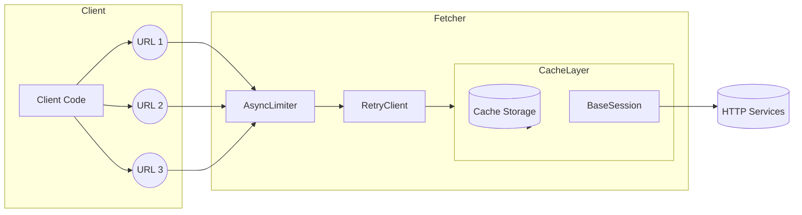

# Overview

`afetch` is a minimalist asynchronous HTTP client built on top of `aiohttp`, targeting small teams (or solo maintainers) who need reliable fetching primitives without maintaining a full networking stack. The library combines sensible defaults for rate limiting, retries, and caching so that network-bound workloads stay predictable even under fluctuating loads.

The current release series (0.x) focuses on production-hardening the existing `Fetcher` abstraction and codifying patterns that have emerged from internal scripts and small services. By documenting the architectural intentions now, we reduce re-discovery cost when future contributors—or a future version of ourselves— revisit decisions around concurrency, cache behavior, and observability.

This design doc captures how the core pieces fit together today, outlines incremental upgrades toward the planned `request()`/handler model, and clarifies what trade-offs we are intentionally making to keep maintenance overhead low.

# Context

The initial motivation for `afetch` was to have a dependable fetch utility for scraping, ingestion, and lightweight API integrations without pulling in larger frameworks. Early experiments highlighted three recurring operational concerns:

1. **Burst traffic** to the same domain caused HTTP 429/503 responses when rate limits were ignored.
2. **Transient failures** (network blips, 5xx responses) needed automatic retries with backoff to avoid manual orchestration.
3. **Redundant requests** against static endpoints could be avoided with a local cache, drastically reducing latency and quota consumption.

Existing solutions (raw `aiohttp`, `requests` wrappers, or higher-level SDKs) either required wiring these concerns manually every time or introduced dependencies that were heavier than necessary. `afetch` aims to stay lightweight while baking in these cross-cutting requirements.

# Scope

This document covers:

- Runtime architecture of the current `Fetcher` implementation.
- Configuration surface (`FetcherConfig`) and its interplay with rate limiting, retry policy, and caching.
- Planned evolution toward a generalized `request()` entry point with response handlers (see dedicated response design doc for deeper dive).
- Operational considerations such as logging, metrics, and deployment boundaries.

Out of scope:

- Detailed protocol-level behavior of `aiohttp`, TLS management, or connection pooling internals.
- Organization-wide governance, packaging, or release automation (handled by README and tooling docs).
- Domain-specific data processing that might consume `afetch` outputs.

# Goal

- Provide a concise abstraction that hides retry, rate limiting, and caching complexity while staying transparent about failure modes.
- Guarantee consistent async context management (`async with Fetcher(): ...`) so resources are deterministic and easy to reason about.
- Lay groundwork for the upcoming handler-based response model without breaking the existing `fetch`/`fetch_all` API.
- Keep dependencies limited to well-maintained ecosystem packages to minimize supply-chain risk and upgrade friction.

# Non-Goal

- Supporting synchronous call patterns or offering drop-in replacements for the standard library’s `urllib`/`requests`.
- Implementing a fully pluggable middleware stack; customization focuses on configuration knobs, not arbitrary hooks.
- Acting as a universal service mesh component—`afetch` remains a client-side utility rather than a platform-wide solution.

# Solution / Technical Architecture

The current architecture centers on a single `Fetcher` class that orchestrates lifecycle management for the three core capabilities: caching, retries, and per-domain rate limiting. A thin `FetcherConfig` dataclass encapsulates tunables and keeps initialization ergonomic.

Key architectural choices:

1. **Async Context Enforcement**: The fetcher refuses to operate outside `async with`, guaranteeing that the cached session and retry client are always cleaned up.
2. **Per-Domain Limiting**: A dictionary of `aiolimiter.AsyncLimiter` instances keyed by domain ensures fairness without serializing unrelated hosts.
3. **Caching Strategy**: `aiohttp-client-cache` (filesystem backend by default) reduces redundant network calls while honoring opt-out via config.
4. **Retry Client**: `aiohttp_retry.RetryClient` wraps the cached session to provide exponential backoff with configurable attempts.

## System Context Diagrams

- **Client Code** (scripts, services) instantiates `Fetcher` and passes URLs.
- **Fetcher** builds on:
  - `CachedSession` (from `aiohttp-client-cache`) for persistence.
  - `RetryClient` (from `aiohttp_retry`) for backoff logic.
  - `AsyncLimiter` (from `aiolimiter`) for concurrency throttling.
- **External Systems**:
  - Target HTTP services.
  - Local filesystem (default cache directory `.afetch_cache`).
  - Optional custom cache backends supplied via `FetcherConfig`.

The fetcher never exposes underlying sessions directly, reducing the chance of misuse.

## APIs

- `Fetcher(config: FetcherConfig | None = None)`
  - Methods:
    - `async fetch(url: str | URL) -> str`
    - `async fetch_all(urls: Iterable[str | URL]) -> list[str]`
    - Async context manager (`__aenter__`, `__aexit__`)
- `FetcherConfig` fields:
  - `max_rate_per_domain: int`
  - `time_period_per_domain: float`
  - `retry_attempts: int`
  - `cache_backend: CacheBackend | None`
  - `cache_enabled: bool`
- **Planned Additions** (tie-in with response design doc):
  - `Fetcher.request()` returning an extensible response abstraction.
  - Handler interfaces to switch decoding strategy while keeping caching and retries centralized.

Backward compatibility will be preserved by layering the new API rather than replacing `fetch()` immediately.

## Data Storage

- Default cache: filesystem-based backend rooted at `.afetch_cache` (configurable when constructing `FetcherConfig`).
- Cache entries include request metadata and serialized response bodies; expiry controlled via backend configuration.
- There is no built-in persistence beyond what the backend provides—no custom schema or database migrations required.
- Users needing alternate storage (e.g., Redis) can supply a compatible backend instance.

# Alternative Solution

| Option                    | Description                                                               | Pros                                                             | Cons                                                                                |
| ------------------------- | ------------------------------------------------------------------------- | ---------------------------------------------------------------- | ----------------------------------------------------------------------------------- |
| Status Quo (`fetch` only) | Maintain current `fetch`/`fetch_all` APIs indefinitely.                   | Minimal work; stable for existing scripts.                       | Hard to extend to binary/streaming use cases; users must reimplement parsing logic. |
| Direct `aiohttp` Exposure | Return raw `ClientSession` to callers for manual control.                 | Maximum flexibility; no additional abstractions.                 | Users reimplement rate limiting/caching each time; higher risk of resource leaks.   |
| Proposed Handler Model    | Introduce `request()` with pluggable response handlers (target solution). | Balances flexibility and safety; standardized response metadata. | Slightly steeper learning curve; requires additional documentation and testing.     |

We proceed with the handler model (in separate doc) while retaining the existing `fetch` for transitional compatibility.

# Milestones

- **2024-07-15** — Stabilize `FetcherConfig` surface and document configuration patterns.
- **2024-07-29** — Implement metrics-friendly logging hooks (`async with Fetcher` instrumentation).
- **2024-08-12** — Deliver `request()` prototype with text/JSON/binary handlers aligned to response design doc.
- **2024-08-26** — Release `afetch` v1.0.0 with dual API (legacy `fetch` + new handler model) and updated docs.
- **Update Policy** — If target dates slip, annotate this section with `[Update: YYYY-MM-DD]` entries.

# Concerns

- **Resource Usage**: Filesystem cache may grow unexpectedly; need guidelines or automatic pruning strategy.
- **Concurrency Limits**: Per-domain limiter assumes cooperative workloads; adversarial or wildcard subdomains might bypass safeguards.
- **Dependency Drift**: Upstream packages (`aiohttp`, `aiohttp-client-cache`, `aiohttp_retry`) evolve quickly—version pinning and upgrade cadence must be maintained.

# Logs

- Short term: rely on upstream logging (aiohttp, cache) controlled via standard Python logging configuration.
- Medium term: expose structured log callbacks (e.g., events for cache hits/misses, retry attempts) to help consumers integrate with observability stacks.
- Ensure logs exclude sensitive headers/body content by default.

# Security

- Do not store TLS credentials or secrets in config; encourage environment-based injection where necessary.
- Caching is opt-out but defaults to filesystem; advise users to disable or supply encrypted backends when handling sensitive data.
- Validate URLs before issuing requests to avoid SSRF-style misuse in higher-level applications.

# Observability

- Planned metrics integration (e.g., counters for successful/failed requests, retry counts, cache hit ratios).  
  Initial implementation will expose hooks so downstream apps can connect to Prometheus or OpenTelemetry exporters.
- Trace support will wrap each request in a span with attributes: domain, attempt index, cache status.

# References

- `docs/design-docs/response.md` — Response handling architecture.
- `README.md` — Public-facing feature overview.
- `src/afetch/fetcher.py` & `config.py` — Current implementation (source of truth for behavior).
- Upstream libraries:
  - `aiohttp` documentation
  - `aiohttp-client-cache` documentation
  - `aiohttp-retry` documentation
